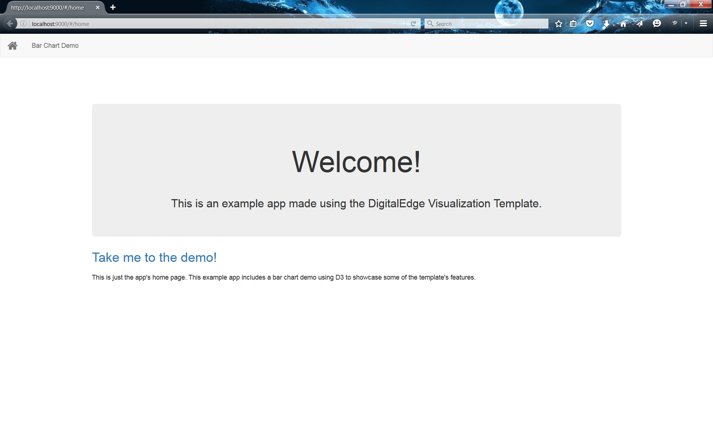
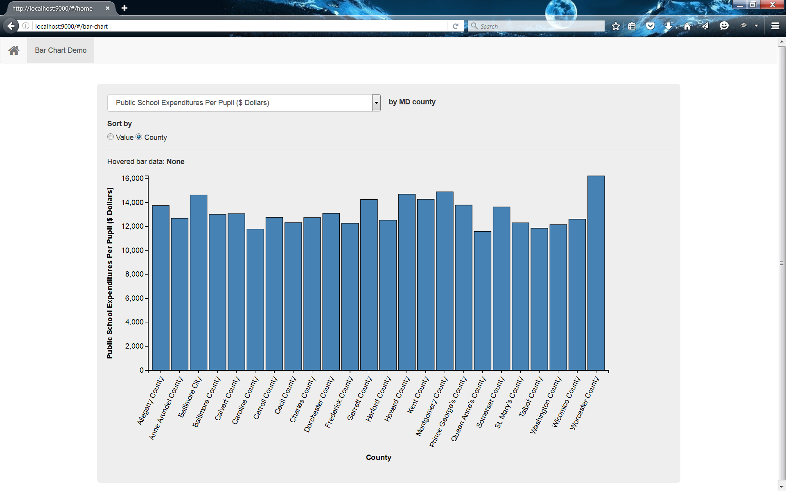

# DigitalEdge Visualization Template Example


##Introduction

This project is intended to showcase the [DigitalEdge Visualization Template](https://github.com/deleidos/de-visualization-angular-sdk) by providing a working example of a bar chart. The bar chart is made using D3 embedded into the template.

##Getting Started

To begin using the template, download or clone the https://github.com/deleidos/de-visualization-angular-sdk-example.git project to your computer.

####Requirements

In order to actively run the template, you will need the following libraries installed on your machine:

1. [node](http://nodejs.org/)
2. [bower](http://bower.io/)
3. [grunt-cli](http://gruntjs.com/getting-started)

####Install Dependencies

The template project requires external development tools and frontend framework code to operate correctly. The development tools include task runners and the karma testing suite while the front-end packages include bootstrap and angular, among others.

* Development tools are installed via `npm`, the node package manager. Tools are listed in package.json.
* Frontend code is installed via `bower`, a client-side code package manager. Front-end libraries are listed in bower.json.

Using a command shell, navigate to the location of the template project.

The template is preconfigured for `npm` to automatically run `bower` so we can simply execute:
```
npm install
```

####Running the Application

The template was designed to use Grunt as an automated task runner. One of the tasks starts a local webserver for easier testing. Starting the server requires the command:
```
grunt serve
```
Grunt should automatically open the system's default browser and navigate to http://localhost:9000

The following page should appear:




####Modules/Functional Areas

In the example, the base home page still exists, but an additional folder containing the bar-chart elements was added. Under the current configuration, the app will load and route to the home view by default.

The bar-chart module contains:

* A bar-chart.module.js file where a module is defined and dependency modules are listed.
* A bar-chart.routes.js file for the routing configuration of the view.
* An html file partial that defines the layout of the page view.
* A bar-chart.controller.js file which adds logic to the view.
* A bar-chart.directive.js and chartForm.directive.js file which extends the HTML attributes to allow for event handling.
* A countyData.filter.js file which controls the data display.
* A countryData.service.js file which showcases an http AJAX data call.
* A reusableChart.d3.js file which contains the core D3 code used to build the chart. This is not angular but is used in the bar-chart directive.

##Troubleshooting

##FAQ

##Maintainers

The DigitalEdge SDK Template is managed by the DigitalEdge team. DigitalEdge is a product of Leidos, Inc.

11951 Freedom Drive
Reston, VA 20190

##License

The DigitalEdge Visualization Template Example is licensed for use under the Apache 2.0 license.
